# Air Informatics (AirIn): An Analysis of GHG (CO2) Emissions & Air Pollution in PA by County and Sector 2009-2019

Contributors: Anthony Hopkins, Andrew Kromer, Dipesh Timsina, Megan Spriesterbach

***Application deployed through Heroku: https://final-ghg.herokuapp.com/***

#### Concept and Purpose

Given the collateral damages predicted by the Intergovernmental Panel on Climate Change (IPCC) in their 2018 and 2021 reports, our group AirIn, a group of four residents of the Commonwealth of Pennsylvania, elected to investigate how our home state contributes to this global problem. Anecdotally, we've heard about the state's impact to CO2 emissions is aggresively negative, but we wanted to apply numbers to that conversation. In this investigation, using data from the World Bank (WB), U.S. Energy Information Administration (EIA), the Environmental Protection Agency (EPA), the Center for Rural America (CRA), and the Bureau of Economic Advancement (BEA) we start with a broad, global scope, and evaluatie the United States of America in comparison to its global coutnerparts. Next, we dive into the 50 states and identify the top contributors to CO2 emissions nationally, of which PA ranks high. Then, we explore PA air quality, CO2 emissions, and the biggest contirbutors by building county by county over the past 10 years. Finally, we evaluate canonically unrelated datasets using CO2 based classifiers in 7 machine learning algorithms from Python's Scikit Learn libary in to offer numerical evidence that suggests a connection between other forms of social injustice and climate change. 

The ultimate purpose of this site is to offer community organizers, the average citizen, lobbyists and adocates alike a dashboard style user interface to learn about their county and the biggest CO2 emitters in them. Additionally, the site is meant to offer some numerical evidence to the concept that different forms of injustices are deeply related to one another.

#### Approach

1. ETL: For the Extract, Transform, Load process we employed the pandas library from python to eliminate unrelated/irrelevant data (for example the CRA data had information dating back to 1900) and to synthesize the datasets in preparation for visualizations. Post extraction and transformation, the data was loaded into a sqlite database database and pulled to the website using the Python SQLAlchemy and JavaScript D3 libraries.

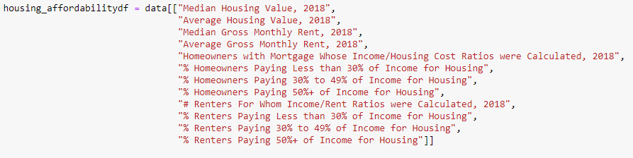 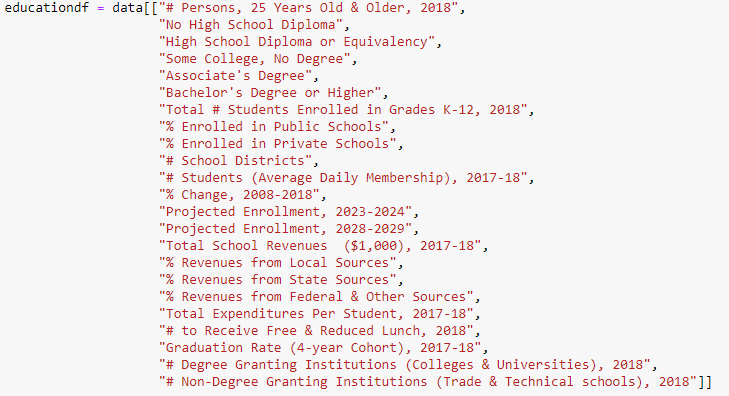

2. Visualization: On a Heroku hosted site structed with HTML and CSS, the Matplotlib library from Python was used for the background visualizations while the user-interactive visualiations were crafted using either embedded Tableau or the Plot.ly library from JavaScript.

3. Machine Learning Classification: Using the cleaned data from the CRA, we employed the following Machine Learning classification algorithms form Python's Scikit Learn library with two classifiers: Support Vector Machines (SVM), K Nearest Neighbors (KNN), Neural Networks (NN), Stochastic Gradient Descent (SGD), Ridge Regression (RR), Random Forest (RFM), and Gaussian Naive Bayes (GNB). We conducted this machine learning study using two classifers that we refer to on the site as the "land based classifer" and the "rate based classifer."

  Land Based: Characterizies a county's CO2 emissions as above or below a national level for average CO2 emissions per area of land.

  Rate Based: Uses the change between the two most recent years of data we had access to for a given county to identify [whether] CO2 emissions were going up or down. 

#### Site Layout

The site is broken down into 5 sections: Home, Background, Machine Learning, Take Action, and About

##### Home

The home page offers a global background regarding CO2 emissions and how the USA stacks up against its counterparts. Throughout the page, the analysis zooms in closer and closer to the Commonwealth of PA to help set the stage for why PA plays a major role in CO2 emissions for the country. 

##### Background

The background page offers an interactive user experience that allows the user to explore any PA county's CO2 emissions over the past ten years. The interactive graphs contain tooltips that highlight the exact amount of emissions, the percentage of the county total, building name, and associated parent companies that own the facility. The interactive section also offers text that highlights the biggest offenders in the commonwealth county wise.

The four visualizations offered for this experience are the following: 

1. Top 10 Counties in CO2 Emissions: a bar graph that depicts the top ten counties in PA for CO2 emissions for the selected year. 

2. CO2 Emissions by Facility Name in County: a donut chart with tooltip capability that shows CO2 emissions by percentage and facility name as well as the parent companies that own a given facility. 

3. Top 5 Parent Companies CO2 Emissions: Highlights the parent companies or conlgomerates of companies that rank in the top 5 for a given county's tabulated CO2 emissions.

4. GHG Emissions vs. Air Pollution (2018): for the year 2018, a bubble chart depicts the relative amounts of CO2 emissions for a given county and how many days in that year the county was over the National Ambient Air Quality Standards (NAAQS). This visualization was meant to demonstrate the lenience in reporting for NAAQS as well as how the metric itself should be investigated more deeply since Armstrong and Indiana counties clearly contain high amounts of CO2 relative to others in the state and yet they only reported one day over NAAQS.

##### Machine Learning

Rather than focusing exclusively on climate data, as a team we wondered if there was anything else contributing to CO2 emissions that was unseen. Community organizers across the nation will tell you that climate injustice is deeply tied to other forms of injustice and intricately so. Given the amount of people that have access to public programs in a county, can a machine tell if the CO2 emissions will be bad? Given information on marginalized communities like folks of color and folks with disabilities, can a machine determine if CO2 levels are within "acceptable" standards? We wanted to prove it.

We wanted to use a high number of classification algorithms with one goal in mind: if we throw these counties' social data outcomes and classifiers at multiple ML algorithms and these models score above 50% with little to no fine-tuning, then there certainly must be correlations between social outcomes and climate change. 

Using data from the Bureau of Economic Advancement and the Center for Rural Pennsylvania, we employed the 7 aforementioned Scikit Learn models on a broad variety of socioeconomic and demographic data for the state of Pennsylvania spanning the last 4-5 years. Using the classifiers defined previously, our goal was to identify if there are any underlying social factors that could point to a county's likelihood to have CO2 levels that are above the national level for average CO2 emissions, or if the county was likely to see an increase or decrease in CO2 levels. 

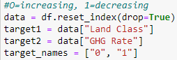

Considering the number of unique datasets we desired to explore, the machine learning was completed in pandas using several inhouse functions to automate the model building process with the following method types (the definitions of these methods are general and applied to all of the models -- for model specifics please see RandomForestCounties.ipynb in the datasets folder in the root directory of this repository to more closely evaluate how the method types were employed): 

- runMODELTYPE(): the function receives a desired subset of data and classifier, converts the dataframe and target column into training and testing datasets, scales the training and testing data, fits the model to the scaled training data, and scores the model with the scaled testing data. Lastly, it outputs the score of the model. 

- iterator(): in the event that a model did not show a stable score (i.e. it needed to learn more or lack of sufficient data), an iterator was employed to capture 50 runs of the model in order to collect an average score.

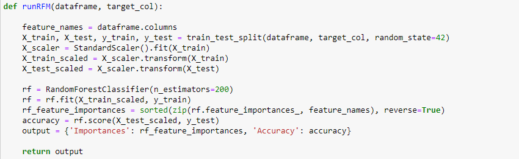

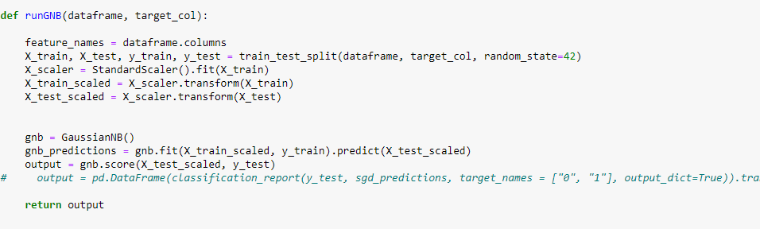

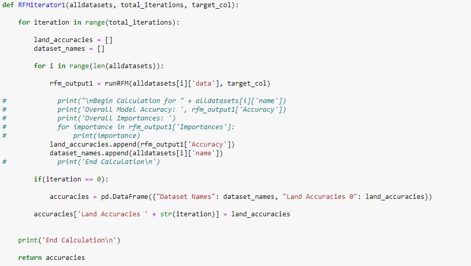

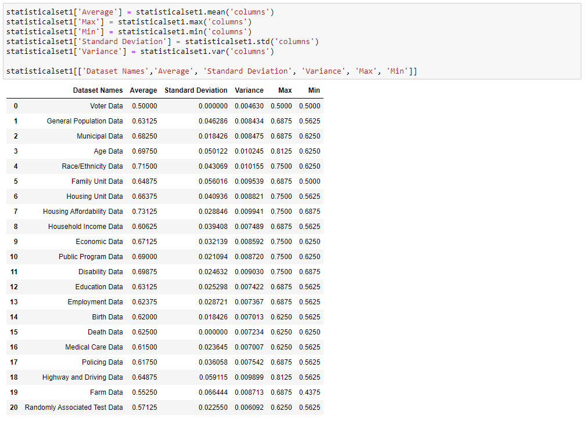

We offer the user an embedded Tableau bar chart and data table so that they can view the results of each machine learning model per data set. 

The results displayed for this section in the bar chart on the website only contain the land classifier as it was our strongest experiment. The data for the rate based classifier is nonetheless present in the table on the page (when applicable) or in the repository. 

##### Take Action

For those interested given all of the motivating information they are seeing about the high levels of CO2 in PA, the take action page is a launch pad for folks to connect with local community organizations that are engaging their communities about climate justice and other forms of justice in the Commonwealth.

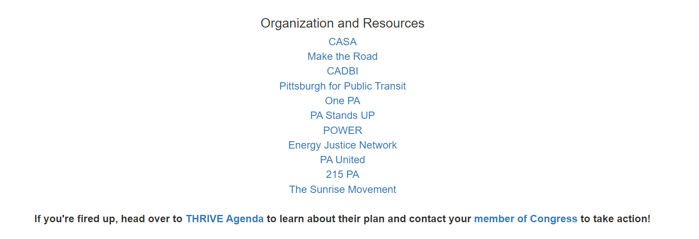

##### About

The about page offers a breakdown of the site as well as links to the four developers LinkedIn pages should anyone want to contact them.

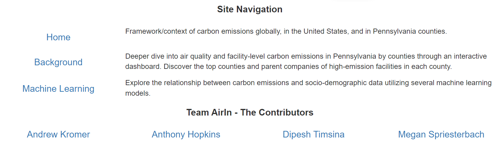

#### Results and Findings

1. In general, the land based classifier scored higher than the rate based classifier consistently. What this means is that across all models, the selected Python supervised learning algorithms were able to predict that CO2 levels would be above/below the national standard if given seemingly unrelated social data sets. Sometimes, that prediction score was a high as 75% or even 81% depending on the data used for predictions (see Age data).

2. In general, the land based classifier scored higher than 50% across all 21 data sets with nearly every single type of classification model employed. There were some unique cases where the model scored well below 50% at about 37% (see Farm data).

3. Although none of these models were scoring above 90% in their predictive capability, it's important to note that these models have little to no fine tuning. We believe this means that there is truth to the anecdote that social injustices/issues and the climate crisis are intertwined. We wonder if remedying these other social injustices may in turn help to chip away at climate change as well. Of course, specific fine tuning for each model should be done per dataset to significantly improve or identify the limits of predictive capability.

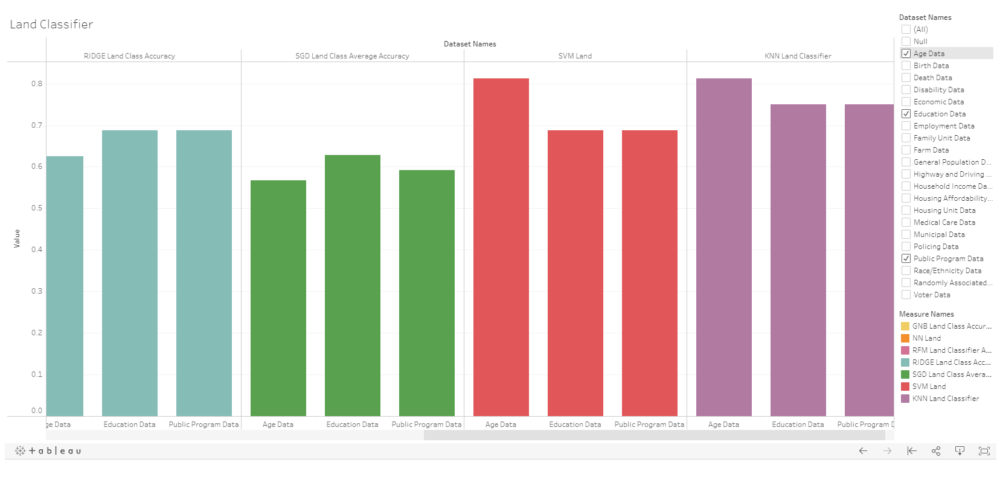

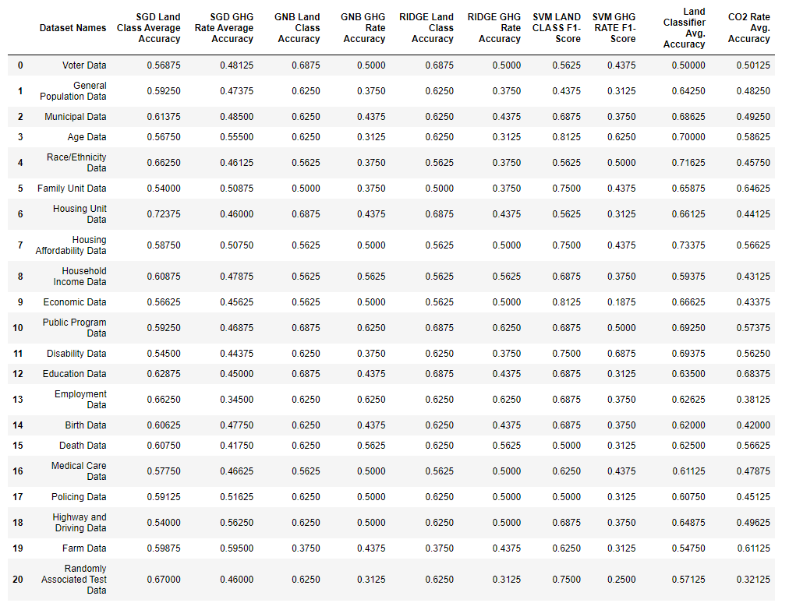

#### Limitations

- These models are not strong enough in prediction capacity to be considered concrete evidence but we do believe that, similarly to the previous section, with fine tuning and better data, the model shows promise for improvement. 

- Given what we know about growing and valid concerns in algorithm bias, we wonder if any of these black box models is apt to interpret and investigate social data the is influenced by underlying social injustices.

- It's important to note that a limitation of this study required us to make intuitive decisions about what data to keep and what to remove. At a glance, we removed about 77 columns of outdated data if the time period was well outside the scope of our study. We only retained the most recent time stamp in a given category of data. 

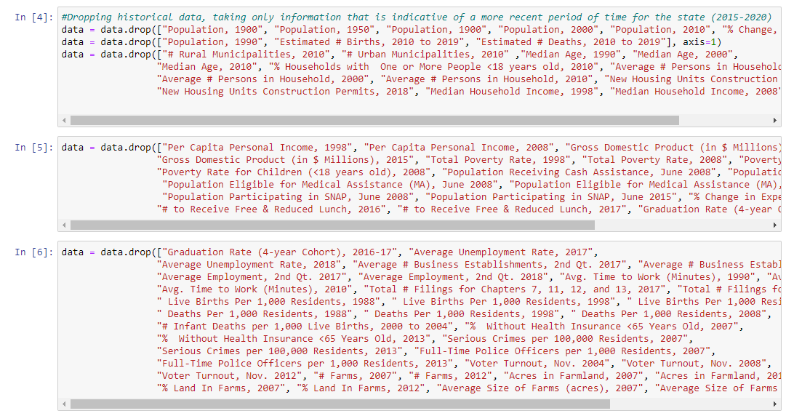

- This leads to the next limitation of the study, some categories of data use the definition of recent to mean as early as 2019 while some only had recent data up to 2017. Ideally, the data should be from the same year so the predictions coming from the model can be as accurate as possible. 

- Fine tuning was only considered once for SVM for one dataset. Ideally, the next step of this study will be to singularly investigate each dataset with each model being appropriately fine tuned per dataset.

- Our data is limited for a number of reasons: at times we did not have access to data from 2019 for each subject we studied within the climate realm, reporting on CO2 is not always consisent from county to county or state to state. So, this is only a rough evaluation of the problem. Should we move forward looking for results that are statistically significant, we will need data that is temporally consistent with itself.

- KNN and NN only have about 8 datasets explored due to time constraints. A future improvement of the study will be to employ these models on all datasets for a more complete analysis. 

#### Conclusions

Although our study didn't reveal predictive capacity above 90% for any of our subsets of data, what we do find interesting is that with seven different classifiers, the model was able to learn and make some functional predictions (At times scoring above 70%) about C02 emissions given other social data. We think this functionally suggests what many community organizers often echo: fights against social injustice are deeply interwoven. Often, climate justice is viewed as this problem exclusively associated with the sky or electric cars. But, as we've seen in this study, some predictions can be made by observing other societal dynamics such as education and access to public programs. So, at a glance, we believe some of this data hints that addressing other injustices in education, housing, etc. will actually helped you address the climate crisis as well. But, it goes without saying that a more in depth study is required to functionally confirm this claim.
