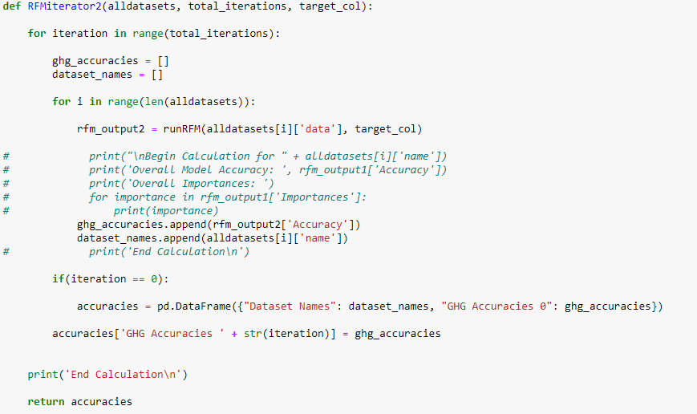

# Air Informatics (AirIn): An Analysis of GHG (CO2) Emissions & Air Pollution in PA by County and Sector 2009-2019

Contributors: Anthony Hopkins, Andrew Kromer, Dipesh Timsina, Megan Spriesterbach

***Application deployed through Heroku: https://final-ghg.herokuapp.com/***

#### Project Overview

Building off of the first project and second project, we decided to look further into GHG emissions in PA and incorporated a machine learning aspect to uncover whether nonobvious factors (demographic, social, economic data) influenced overall GHG emissions in PA. The dataset used was from the Center for Rural Pennsylvania (https://www.rural.palegislature.us/county_profiles.cfm).

#### Project Requirements and Approach

- Use Machine Learning in the context of technologies learned
  - Use SciKit-Learn and/or another ML library
- Must use at least two of the below (our team used the ones in bold)
  - **Python Pandas**
  - Python Matplotlib
  - **HTML/CSS/Boostrap**
  - JavaScript D3.js (from Project 2)
  - JavaScript Leaflet
  - SQL Database (from Project 2)
  - MongoDB
  - Google Cloud SQL
  - Amazon AWS
  - **Tableau**
- Host application using Heroku or tool of your choice (see Heroku link above)

#### Machine Learning Component

#### **Random Forest**

Using data from the Bureau of Economic Advancement and the Center for Rural Pennsylvania, we employed Scikit Learn's Random Forest Model on a broad variety of socioeconomic and demographic data for the state of Pennsylvania spanning the last 4-5 years. Using the classifiers Andrew defined previously, our goal was to identify if there are any underlying social factors that could point to a county's likelihood to have CO2 levels that are too high for the given standard, or if the county was likely to see an increase or decrease in CO2 levels in the future given the recent social data. The original datasets contained historical data that, at times, dated back to 1900. So, it's important to note that a limitation of this study required us to make intuitive decisions about what data to keep and what to remove. At a glance, we removed about 77 columns of outdated data if the time period was well outside the scope of our study. We only retained the most recent time stamp in a given category of data. This leads to the next limitation of the study, some categories of data use the definition of recent to mean as early as 2019 while some only had recent data up to 2017. Ideally, the data should be from the same year so the predictions coming from the model can be as accurate as possible. 

#### K Nearest Neighbor

We used k-nearest neighbors (kNN) classification to evaluate the Pennsylvania General Assembly data set. Values for k were assessed by comparing scores from the training and test data and scoring k when the data began to stabilize (colloquially known as the elbow method). Data sets were evaluated using the best k value as determined above, and the accuracy of the entire model was tested using the metrics feature of sklearn.

kNN classification with the land classifier was most successful using the General Population and Age data sets (81.2% accuracy). Other sets including Voter, Municipal, Race/Ethnicity, and Education all achieved 75% accuracy. The least successful data sets included Employment (56.2%), Medical Care (62.5%), and Policing (62.5%). Classification with the rate classifier was generally less successful overall, though many of the highest accuracy scores followed the land classifier: General Population (62.5%), Age (68.8%), and Education (68.8%). 

#### **Discovery Process**

For the sake of investigation, we ran the Random Forest algorithm with 1000 estimators on all 304 features, and then the remaining 225. The resulting accuracy was at 50% or lower in both cases. In an attempt to pare down the decision making options for the model, and with the historical data removed, we group the data into 21 subsets spanning subjects by county such as municipality, household income, education, access to public programs, employment, etc. We later learned that this attempt to reveal strong correlations with smaller subsets of data was also a trial in grappling with a phenomenon known as Simpson's Paradox within our datasets. Briefly, Simpon's Paradox is a term used to define the occurrence of a trend existing in a broad set of data, but when the data is categorized into subsets, the trend disappears. So, when the data was considered altogether there were no obvious social features that the model could use to predict the rate of C02 changing or if the C02 levels in a given county were good or bad. But, could the same be said when the data was evaluated by subset? Are there lurking variables that could help unearth a hidden trend? Taking advantage of Scikit Learn's StandardScaler and train_test_split libraries, we developed a function known as runRFM().

 

- **runRFM():** the function receives a desired subset of data and the user selected classifier, converts the dataframe and target column into training and testing datasets, scales the training and testing data, fits the random forest to the scaled training data, and scores the model with the scaled testing data. Lastly, it outputs the importance of each feature alongside the overall accuracy of the model with the given data.We used different combinations of data subsets and the two classifiers in search of correlations between CO2 emissions and the social data. What we immediately identified is that repeated runs of the model would return different accuracies, some as high as 80% and some as low as 62% for the same combination of data and classifier.So, we developed two functions to run the RFM on all 21 subsets of data using the two different classifiers:
  - **RFMiterator1():** Specifically for the land based C02 classifier, receives all subsets of data, the number of iterations/times the user wants to run the Random Forest Model, and the target classifier column the user wants to use to buidl the Random Forest.
  - **RFMiterator2():*** Specifically for the rate based C02 classifier, receives all subsets of data, the number of iterations/times the user wants to run the Random Forest Model, and the target classifier column the user wants to use to buidl the Random Forest. This function specifically does this process with the land based C02 classifier.Using these three functions, we ran the RFM with 200 estimators on each subset of data 50 times. We then collected basic statistical metadata on the total number of iterations per data subset such as mean, standard deviation, variance, max, and min.

#### **Findings**

**Land Classifier**

When running the random forest model using the land based classifier, the average accuracy of the model was generally higher than with the CO2 rate based classifier. The model ran most successfully with Race/Ethnicity data and Housing Affordability Data. That is to say the model was making the most accurate predictions for CO2 levels when considering these data exclusively. That said, the accuracy of the model was 71.1% and 72.3% respectively. Public Program Access and Age Data also showed some promise coming in closely behind at 69.0% and 69.6% respectively. We recognize that the prediction capacity of this test is nowhere where it needs to be for it to be a trustworthy prediction source. But, this work was completed with little to no fine tuning of the model arguments themselves. Additionally, we could also consider removing the least important features of the model and re-run the model without them to see if it improves overall accuracy. 

**C02 Rate Classifier**

When running the random forest model using the C02 rate based classifer, the average accuracy of the model was generally lower than the land based classifier and predictions had higher standard deviations relatively speaking. The model ran most successfully with Education data (67.3%) and Family Unit data (64.5%). 

#### Limitations

- These models are not strong enough in prediction capacity to be trusted but we do believe that, similarly to the previous section, with fine tuning and better data, the model shows promise for improvement. 
- Random Forest could also be the wrong Machine Learning approach given the complexity and non-linearity of the social data employed. Although scikit learn has quite a few models at the user's disposal, given what we know about growing and valid concerns in algorithm bias, we wonder if any of these black box models is apt to interpret and investigate social data the is influenced by underlying social injustices. 

#### Conclusions

Although our study didn't reveal predictive capacity above 90% for any of our subsets of data, what we do find interesting is that with two different classifiers, the model was able to learn and make some functional predictions (At times above 70% of the time) about C02 emissions given other social data. We think this functionally suggests what many community organizers often echo: fights against social injustice are deeply interwoven. Often, climate justice is viewed as this problem exclusively associated with the sky or electric cars. But, as we've seen in this study, some predictions can be made by observing other societal dynamics such as education and access to public programs. So, at a glance through this study, we believe some of this data hints that addressing other injustices in education, housing, etc. will actually helped you address the climate crisis as well. But, it goes without saying that a more in depth study is required to functionally confirm this claim.
